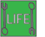

# TANKS AT WAR

### Video Demo:  <https://youtu.be/h0b7lAQZPYE>

### Description:

Hello, I'm Mario Silva, I'm from Venezuela but I live in Portugal. The name of my final project for the CS50 Course is "Tanks At War", a game developed by myself using Lua and Love2d. All music, sound effect, and image files were made by myself. I am a musician so I know how to compose music and make sound effects, I worked with Ableton Live 11 and the Arturia midi keyboard to make the 3 music tracks and the 4 sound effects.

#### 1- How to Play?

__Instructions:__

In Tanks at War we are a little purple/blue tank where our goal is to beat the others orange/red tanks and the three bosses tanks through three waves.

Player:

Enemy:

Big Enemy:

__Life System:__

The life system is represented by 4 lines: green, yellow, orange and red. Each line represents 1 life point and therefore the player has 4 life points.

* 1 enemy bullet subtracts 1 life point from the player.

* 1 big enemy bullet subtracts 3 life point from the player.

* If the player crashes with an enemy tank or big enemy tank it subtracts 4 life point (all) from the player.

* The 4 lines of life are at the bottom left corner.

__Items:__

There are 2 items:
* Life: Restores the life points
* Ammo: Accelerates the shooting speed

 

#### 2- Controls

* __Arrow Keys:__ Move
* __x:__ Speed up
* __s:__ Shoot
* __Esc:__ Pause the game

#### 3- About The Development of The Game

__Folders:__

This project has 2 folders:

* **_audio:_** Contains all audio files (music and sound effects).
* **_sprites:_** Contains all image files, such as backgrounds, enemies sprites, player sprites, and the items sprites.

__Lua Files:__

This project has 11 lua files. For convenience, I made all game functions into separate files, sorted by topic. Into those files I divided with comment lines which function is for love.load() and which is for love.draw()

* __1- main.lua:__ Contains all global variables, tables, and the main functions such as **_love.load()_**, **_love.update()_** and **_love.draw()_**.

    * **_Global Variables_**:
        * **_fonts_** is a *table* that stores the default font size.

        * **_menu_** is a *table* that stores the boolean variables to verify if the user is in the main menu or in the controls menu.

        * **_game_** is a *table* that stores the boolean variables to verify if the game started or the player won the game.

        * **_time_** is a *table* that stores the number variables to create a time lapse with the help of others functions.

        * **_pause_** is a *table* that stores the variables that help to create the pause menu along with others functions.

        * **_screen_width_** stores the width resolution, in this case 1280px.

        * **_screen_height_** stores the height resolution, in this case 720px.

    * **_love.load()_** is the function that comes with *love2d* and contains all tables and variables for the player, backgrounds,  audio and restart screen.

        * **_player_** is a *table* that stores all the variables for the player, such as tank sprites, bullet sprite, x-axis position, y-axis position, speed, direction, life bar, and a boolean variable called *defeated* to verify if the player is or is not defeated.

        * **_bg_** is a *table* that stores all the background images for the game, such as main menu, controls menu, main game, pause menu, defeated screen and "you won" screen.

        * **_audio_** is a *table* that stores all the music and sound effects for the game. There are 3 music tracks: main menu music, main game music and winner music.

        * **_play_** is a *table* that stores all the boolean variables to verify which music or sound effect is playing in the game.

        * **_restart_screen_** is a variable to verify if the player is in the restart screen.

    * **_love.update()_** is the function that comes with *love2d* and updates the game. It contains all functions from the others .lua files that make the game works. With the help of the global boolean variables I made 4 status in the game:

        * **_1- Main Menu:_** if game did not start and the player did not win yet then the player is in the *Main Menu*. At this point, if the player press *c* key, it actives the *Controls Menu* with the function **_controls_menu()_** and can return to the *Main Menu* pressing *Esc* what actives the function **_controls_to_main()_**. On the other hand if the player press *Enter* key in the *Main Menu*, it actives the function **_start_game()_** and the game then starts. The function *audio* will play both menu and game music, it depends of the booleans variables in the *table* **_play_**

        * **_2- Game Started:_** if the player is not in the *Main Menu* and is not in *Control Menu* then is in the *Main Game*. Within this "status" the function **_love.update()_** calls the other helper functions to create all the objects that will be drawn with the help of **_love.draw()_**, such as:

            * **_Player_**: direction, movement, speed up (pressing *x* key), shootings and life.

            * **_Enemies_**: direction, movement, shootings, and show the sprite of the enemy defeated when it is collides with a player bullet and disappear it.

            * **_Items_**: create the life restorer box and the ammo box to increase the shooting speed of the player shooting.

            * **_Waves_**: create the three waves in the game. The first wave has 10 enemy tanks in fixed positions and the shooting speed of the enemies is 200 * dt. The second wave has 20 enemy tanks in random positions and the enemy shooting speed increases to 400 * dt, in this wave appears the first *life restorer box* . The third wave is the last one, and it has three *big enemy tanks* and they shoot every 5 seconds 20 bullets with a speed of 1500 * dt, in this wave appear both *life restorer box* and *ammo box*. All normal enemies have 1 life point so 1 player bullet can beat a normal enemy but the big enemy tanks have 400 life points so 400 player bullets are needed to beat a big enemy tank.

            * **_Big Enemies_**: direction, movement and shooting of the *Big Enemy Tanks".

            * **_Collisions_**:  have all the functions that verify if exist the following collision:

                * Player bullet with normal enemy.

                * Enemy bullet with the player.

                * Player bullet with an enemy bullet.

                * Player crashes with an normal enemy.

                * Player collects an item.

                * Player crashes with a big enemy.

                * Player bullet with a big enemy.

                * Player bullet with a big enemy bullet.

                * Big enemy bullet with the player.

            * **_2.1- The Player is Defeated_**: This is a "sub-status", it this occurs when the player is defeated by an enemy. Here the function **_wait_restart_** makes a time lapse of 3 seconds and then show the "you lost" screen. The function **_player_defeated()_** reset all variables to the default value and the function **_restart()_** calls **_love.load_** if the *Enter* key is pressed. On the other hand, if the *M* key is pressed then the function **_restart()_** changes *game.start* to false *menu.main_menu* to true to show the *Main Menu*. This function also changes in both cases the variable *game.win* to false in case that the player won the game and want to restart the game or go to the *Main Menu*.

        * **_3- Pause Screen_**: this "status" occurrs when the player presses the *P* key and it activates the function **_pause_game()_** and it changes the boolean variable *pause.menu* to show the *Pause Screen* with the help of the **_pause_draw()_** in **_love.draw()_** function.

        * **_4- You Won Screen_**: it is the last "status", here the function **_win_game_music()_** stops the current music and plays the winner music. On the other hand **_player_defeated()_** reset all variables to the default value and the function **_restart_win()_** calls **_love.load_** if the *Enter* key is pressed. On the other hand, if the *M* key is pressed then the function **_restart()_** changes *game.start* to false *menu.main_menu* to true to show the *Main Menu*. In this case this function will change in both cases the variable *game.win* to false, so the player can restart the game or go to the *Main Menu*.

    * **_love.draw()_** is the function that comes with love2d and draw all the graphics (iamges such as sprites, backgrounds, etc.) in the screen. It contains all functions from the others .lua files. There are 4 "status":

        * **_1- Main Menu_**: if the *menu.main_menu* variable is *true* then the **_main_menu_draw()_** function will draw the *Main Menu* screen.

        * **_2- Coltrols Menu_**: if the *menu.controls* variable is *true* then the **_controls_menu_draw()_** function will draw the *Controls Menu* screen.

        * **_3- Game Started_**: in this "status" all the elements of the game, such as background, player, enemies, player bullet, player movement, enemy bullets, enemy movements, items, etc. will be drawn with the help of the each respective function. Also exist another "sub-status":

            * **_3.1- Pause Screen_**: with the help of the **_pause_draw()_** function, if *pause.menu* is *true* then this function will draw the *Pause Screen*.

            * **_3.2- The Player is Defeated_**: if *player.defeated* is *true* and *restart_screen* is also *true* then the **_player_defeated_draw()_** function will draw the "You Lost" screen.

        * **_4- You Won Screen_**: if the *game.win* is true then the **_you_won_draw()_** function will draw the "You Won" screen.

* __2- audio.lua:__ Contains all functions to play the music and sound effects.

    * **_music()_** plays (and stops) the main menu and the game music with the help of the "audio boolean variable" **_play.main_music_**  which is stored in the table **_play_** and the **_game.starts_** variable which is stored in the table **_game_**, both tables are located in **_main.lua_**.

    * **_win_game_music()_** plays the winner music when the player win the game. It uses the **_play.win_game_** variable from the table **_play_**.

    * **_big_ebullet_sound()_** plays the sound effect when a big enemy shot a bullet.

    * **_player_defeated_sound()_** plays the sound effect when a player is defeated.

    * **_pbullet_sound()_** plays the sound effect when a player shoots a bullet.

    * **_enemy_defeated_sound()_** plays the sound effect when an enemy is defeated.

* __3- collisions.lua__ Contains all variables and functions to verify the collisions in the game.

    * **_defeated_** is a table that stores the enemy defeated sprite, big enemy defeated sprite and a table to store the defeated enemies.

    The functions that I made for collisons.lua are:

    * **_collisions_** is to verify if two objects collide. The conditions are:

        * X1 < X2 + W2
        * X2 < X1 + W1
        * Y1 < Y2 + H2
        * Y2 < Y1 + H1

        where *X* is the current position of the object in x-axis, *Y* is the current position of the object in y-axis, *W* is the width in pixels of the object and *H* is the height of the object.

    * **_big_enemy_to_tank()_** is to verify if player crashes with a big enemy, in this case the player lose all life points and the player lose the game.

    * **_bullet_to_bullet()_** is to verify if a player bullet collides with an enemy bullet, in this case both bullet will disappear.

    * **_pbullet_to_big_bullet()_** is to verify if a player bullet collides with an big enemy bullet, in this case only the player bullet will disappear.

    * **_collected_item()_** is to verify if the player collects an item.

    * **_current_psprite()_** is to update the *player.direction* variable. There are 5 directions: up, down, right, left and defeated. It helps to update the love.draw() function to draw the current position sprite.

    * **_player_defeated()_** this function resets all variables to start again the game or (with help the another function) go to the *Main Menu*. This function is activated when the *player.defeated* variable is *true* or the *game.win* variable is *true*.

    * **_ebullet_to_player()_** is to verify if an enemy bullet (normal enemy) collides with the player. If it happens then the player will lose 1 life point.

    * **_big_ebullet_to_player()_** is to verify if an big enemy bullet collides with the player. If it happens then the player will lose 3 life point.

    * **_edefeated_disappear(dt)_** is to make disappear an enemy defeated sprite after 2 seconds.

    * **_pbullet_to_enemy()_** is to verify if a player bullet collides with a normal enemy. If it happens then the enemy will be defeated.

    * **_pbullet_to_big_enemy()_** is to verify if a player bullet collides with a big enemy. If it happens then the big enemy will lose 1 life point (each big enemy has 400 life points).

    * **_tank_to_tank()_** is to verify if player crashes with a normal enemy, in this case the player lose all life points and the player lose the game.

    * **_edefeated_disappear_draw()_** is to draw the defeated enemies.

    * **_player_defeated_draw()_** is to draw the player defeated sprite.

* __4- conf.lua__ is a default lua file that love2d uses. The configuration used for this game is:

    * *Title*: Tanks At War.

    * *Resolution*: 1280px x 720px

    * *Fullscreen*: **_false_**

    * *Resizable*: **_false_**

* __5- controls.lua__ this file stores all the functions that require pressing a key to do an action in the game or in the menu screens. These functions are:

    * **_controls_menu()_** is to go to the *Controls Menu* when the The player presses the *C* key in the *Main Menu*. This function changes *menu.main_menu* to *false* and *menu.controls* to *true*.

    * **_controls_to_main()_** is to return to the *Main Menu* when the player presses the *Esc* key in the *Controls Menu*. This function changes *menu.main_menu* to *true* and *menu.controls* to *false*.

    * **_directions(dt)_** this function changes the *player.direction* variable to *up*, *down*, *left* and *right* when the player presses the respective *Arrow Key*. This function will help **_directions_draw()_** function to draw the respective player sprite.

    * **_pause_game(dt)_** is to pause the game when the game starts. This function changes *pause.menu* to *true* or *false* (depending on whether the player is or is not in the *Pause Menu*) when the *Esc* key is pressed. This function helps **_pause_draw()_** function to draw the *Pause Menu*.

    * **_restart()_** when the player is defeated then appears the *You Lost* screen, at this point if the player presses the *Enter* key then the game will restart. This function makes the music stop, and calls the **_love.load_** function to restart the game. On the other hand, if the player presses the *M* key then will appear the *Main Menu*.

    * **_restart_win()_** works like **_restart()_** but it will be used when the player win the game, so the player can restart the game or go to the *Main Menu*.

    * **_speed_up()_** when the player presses the *X* key the tank increases the speed. The normal speed is 50 * dt and the increased one is 300 * dt.

    * **_start_game()_** when the player presses the *Enter* key and is in the *Main Menu* the game starts. This function changes *menu.main_menu* to *false* and *game.starts* to *true*.

    * **_controls_menu_draw()_** draws the *Controls Menu* screen.

    * **_directions_draw()_** draws the respective sprite according to the current player direction (*player.direction*).

    * **_main_menu_draw()_** draws the *Main Menu* screen.

    * **_pause_draw()_** draws the *Pause Menu* screen.

    * **_you_won_draw()_** draws the *You Won* screen.

* __6- ebullets.lua__ stores all information (tables, variables and functions) about the *enemy bullets*. There are 2 tables:

    * **_ebullet_** stores all information about each bullet shot by a normal enemy, such as speed, delay for each bullet, and a nested table called *ebullet.bullets* that stores each enemy bullet shot, this nested table stores the bullet sprite (*img*) and the direction of the shot (*shot_direction*).

    * **_big_ebullet_** stores all information about each bullet shot by a big enemy, such as speed, delay for each bullet, bullet counter and a boolean variable called *big_ebullet_shot*, the counter and the boolean variable are necessary to make a limit of shots and create a small time lapse where the big enemy can't shoot, because the bullet speed here is much faster than the shooting of the normal enemies. This table also has a nested table called *big_ebullet.bullets* that stores each big enemy bullet shot, this nested table stores the big bullet sprite (*img*) and the direction of the shot (*shot_direction*).

    The functions in this file are:

    * **_big_enemy_shot(dt)_** creates the bullet shot by the big enemies. A big enemy can only shoot 20 bullets every 5 seconds, *big_ebullet.counter* counts the number of bullets and the function **_wait_big_bullet_w3_** create a time lapse of 5 seconds where the big enemy can't shoot. This function updates the nested table *big_ebullet.bullets* to create each bullet.

    * **_big_enemy_shot_wave3(dt)_** is to verify if the current wave is the third one with the *ws.current* variable (ws = waves) that was create in *enemies.lua*.

    * **_big_enemy_shot_movement(dt)_** using the information of each big bullet, this function updates the current potision of the big bullet to create the movement of it.

    * **_enemy_shot_config()_** this function modifies the bullet speed and delay of the normal enemies depending to the current wave. In the first wave the speed is 200 * dt and the delay is 0.9, in the second one the speed is 400 * dt and the delay is 0.3.

    * **_enemy_shot(dt)_** works similar to **_big_enemy_shot(dt)_** but for the normal enemies there is not restrictions for the number of bullets, in this sense the normal enemies will always be shooting. This function updates the nested table *ebullet.bullets*.

    * **_enemy_shot_movement(dt)_** using the information of each bullet, this function updates the current potision of the bullet to create the movement of it.

    * **_enemy_shot_draw()_** draws the bullets of the normal enemies.

    * **_big_enemy_shot_draw()_** draws the big bullets of the big enemies.

* __7- enemies.lua__ this file stores all the information about the normal and big enemies. The *tables* that store all this information are:

    * **_enemy_** stores the sprites of the normal enemy (up, down, right left) and the big enemy (down), the current direction of the normal enemy (*enemy.direction*) and the bullet sprites of both normal and big.

    * **_enemies_** this *table* is to store each normal enemy information, this information will be used to draw each enemy later.

    * **_big_enemies_** this *table* is to store each big enemy information, this information will be used to draw each enemy later.

    * **_ws_** this *table* stores only one variable *ws.current* (means "current wave"), to store the number of the current wave (the game only has 3 waves).

    * **_wave1_** this *table* has the informarion such as the counter of the enemies, a boolean variable (*wave1.starts*) to verify if the wave started, the speed of each enemy, the delay of the enemy spawn, and the positions in the x,y-axis. In this wave the maximum number of enemies is 10.

    * **_wave2_** this *table* has the informarion such as the counter of the enemies, a boolean variable (*wave2.starts*) to verify if the wave started, the speed of each enemy, the delay of the enemy spawn. In this wave the position of each enemy will be random and the maximum number of enemies is 20.

    * **_wave3_** this *table* has the informarion such as the counter of the enemies, a boolean variable (*wave3.starts*) to verify if the wave started, the speed of each big enemy, life points,  and the positions in the x,y-axis. This wave has only 3 big enemies.

    The functions in this file are:

    * **_enemies_spawn_wave1(dt)_** is to spawn each enemy for the first wave. There will be 10 enemies, 8 will appear in the top of the screen, 1 at the left and 1 at the right. This function creates an spawn delay for each enemy. When the player defeates the last enemy the variable *wave2.starts* changes to *true* and the wave 2 starts.

    * **_enemies_spawn_wave2(dt)_** is to spawn each enemy for the second wave. There will be 20 enemies, the initial position of each enemy will be random. When the player defeates the last enemy the variable *wave3.starts* changes to *true* and the wave 3 starts.

    * **_enemies_spawn_wave3(dt)_** is to spawn the three big enemies in the thrid wave. They will be at the top of the screen and their movement will be only forward and backward. The three big enemies will spawn at the same time and the movement will always be the same for the three ones. When the player defeates the last enemy the variable *game.win* changes to *true* and the player wins the game.

    * **_big_enemies_move(dt)_** is to update the current position of each big enemy.

    * **_enemies_move(dt)_** is to update the current position of each normal enemy.

    * **_enemies_draw()_** is to draw the normal enemies.

    * **_big_enemies_draw()_** is to draw the big enemies.

* __8- items.lua__ this file stores all information about the two items in this game: the *life restorer* box and the *ammo* box. There is only 1 *table*:

    * **_items_** stores the two item sprites and a boolean variables to make their appear in the wave 2 and 3 and a nested *table* called *items.draw* that will store the information of each item that will be drawn later.

    The functions in this file are:

    * **_items_spawn()_** it creates the items that will be appear in the wave 2 and 3.

    * **_items_draw()_** is to draw the items in the respective wave.

* __9- life.lua__ this file stores the information needed for the life system of the player. The functions are:

    * **_player_life()_** it tests if the life points are equal to or less than zero with the variable *player.life*, if it is *true* then the player lose the game.

    * **_player_life_draw()_** is to draw the life bar, since the life bar has 4 lines (each line represents 1 life point), there is a conditional statement to verify which sprite of them to draw.

* __10- pbullet__ this file contains all information about the player bullets. There is only 1 *table*:

    * **_pbullet_** this *table* has each element of the bullet such as delay, speed, direction and a nested table called *pbullet.bullets* to store the information for each bullet shot.

    The functions in this file are:

    * **_player_shot(dt)_** when the player presses the *S* key the function first tests the time delay and then verify the direction of the player to create a bullet according to the current position of the player.

    * **_player_shot_draw()_** is to draw each player bullet.

* __11- waiting.lua__ this file stores the two functions that help to create a time lapse in at certain times. Both functions have two arguments: *dt* (delta time) and *seconds* (the number of seconds to create a time lapse). These functions are:

    * **_wait_restart(dt, seconds)__* used in **_love.update()_** to create a time lapse of 3 seconds when the player is defeated.

    * **_wait_big_bullet_w3(dt, seconds)_** used in **_big_enemy_shot(dt)_** (ebullets.lua) to create a time lapse of 5 seconds when the big enemies shoot 20 bullets.

#### 4- Special Thanks

 I want to thank the entire staff of the CS50's Introduction to Computer Science, this course changed my life completely, was very challenging but I am finally here, I am 27 years old and I am a musician by profession, I started this course because I wanted to try this other area that I love and thanks to this course I am determined to continue studying to someday become a great programmer. Thank you again.